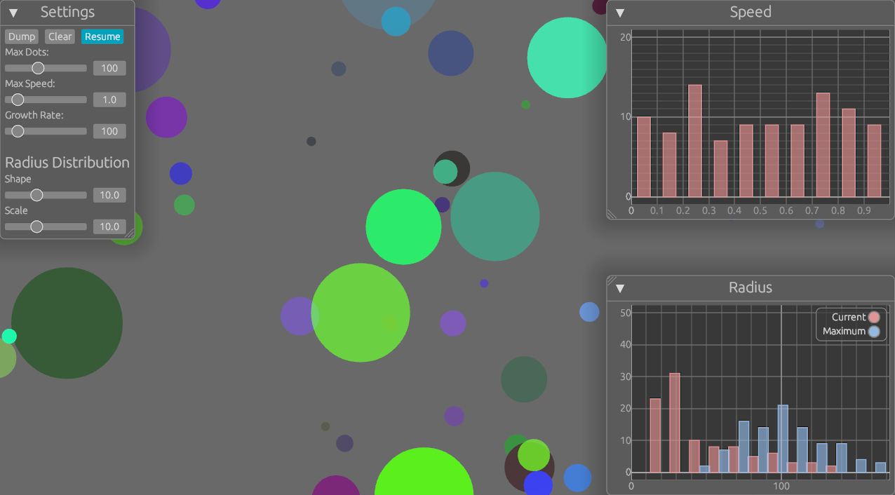

Simplistic demo of Nannou with egui controls and plots.

Based on an older Nannou [tutorial](https://dev.to/deciduously/creative-coding-in-rust-with-nannou-1lbl) by Ben Lovy
and [Nannou examples](https://github.com/nannou-org/nannou/blob/master/examples/ui/egui/simple_ui.rs).

Run with cargo:
```bash
$ cargo run -- -n 100
```

Run with nix:
```bash
$ nix run . -- -n 100
```


